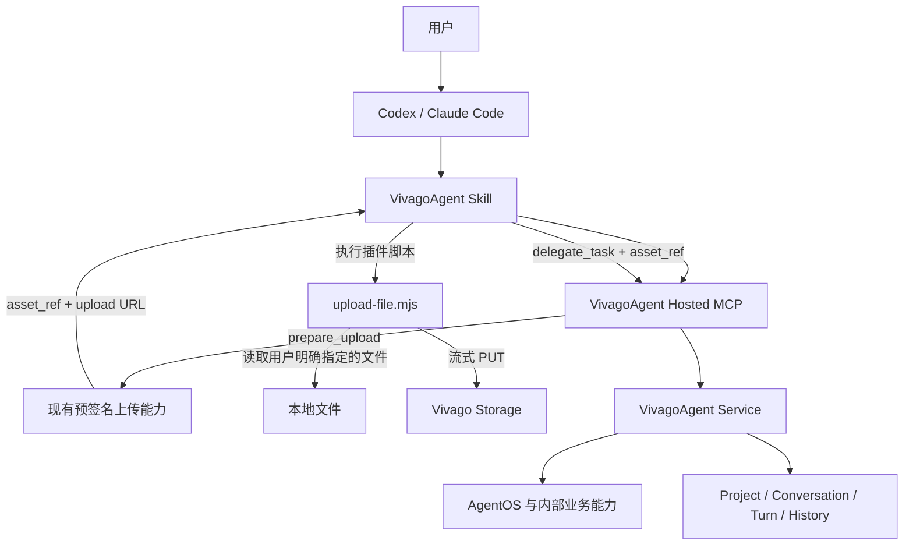

# VivagoAgent Hosted MCP + 插件内置文件 Helper 设计

状态：未来公开阶段参考，非当前实施主线

日期：2026-08-04

适用范围：迁移到 Hosted MCP 后，且宿主附件能力无法满足本地上传时

当前实施采用 Go CLI-first，不建设 Hosted MCP、标准 OAuth 或文件 Helper。
阶段划分和启动条件以
[`2026-08-07-vivago-agent-cli-go-public-beta-design.md`](2026-08-07-vivago-agent-cli-go-public-beta-design.md)
为准。本文只保留未来确有本地上传缺口时的最简实现参考。

## 方案要解决什么

VivagoAgent 对宿主提供的是粗粒度 Agent 能力：创建项目、委派任务、查询进度、继续会话、取消和读取历史。项目、conversation、turn、历史和产物记录继续由 VivagoAgent 保存，插件不复制会话，也不暴露 AgentOS 内部业务工具。

本地文件需要单独处理。Hosted MCP 运行在服务器上，不能读取 `/local/path/video.mp4` 这样的客户端路径。参考 ChatCut 的交付方式，插件里放一个本地上传脚本：Hosted MCP 先返回预签名上传地址，本地脚本读取文件并直传对象存储，成功后再把文件引用交给任务。

这里不照搬 ChatCut 的完整上传系统。Vivago 当前已经有“申请预签名 URL → PUT 文件 → 把 OSS key 放进消息”的实现，第一版只把本地读文件和 PUT 部分移到插件脚本，不新增 upload session、上传状态机、finalize 接口或 Asset 表。

## 一句话设计

业务操作走 Hosted MCP；本地文件先调用 `prepare_upload` 获取 `asset_ref` 和预签名 URL，再由插件内置 `upload-file.mjs` 流式 PUT。PUT 成功后直接用 `asset_ref` 提交任务。预览和下载交给 Codex、Claude Code 自己处理。

## 总体结构



文件字节不经过 MCP JSON 和 VivagoAgent 业务服务。MCP 只返回上传计划和文件引用。

## 当前实现已经有什么

当前 CLI 的 `_upload_attachment()` 已经跑通以下行为：

1. 按媒体类型生成随机 OSS key；
2. 使用当前 Vivago ticket 调用 `/prod-api/user/google_key/{bucket}`；
3. 接口返回预签名 PUT URL；
4. CLI 把文件上传到该 URL；
5. chat 消息只携带 OSS key、媒体类型和文件名。

最简方案不改变服务端语义，只替换本地执行方式：当前 Python CLI 会一次性 `read_bytes()`，插件 Helper 改用 Node stream，避免 300 MiB 视频全部进入内存。

## 从 ChatCut 借鉴什么

只借鉴三点：

- 上传脚本跟随 Skill 一起发布，用户不需要单独安装上传程序；
- 本地脚本读取文件，文件字节直接上传对象存储；
- stdout 输出稳定 JSON，进度和诊断写 stderr。

以下能力不复制：

- import session 和 session token；
- 客户端视频转码、缩略图和转写音频；
- Asset placeholder 和上传状态机；
- multipart、断点续传和分片恢复；
- 独立 finalize 接口。

这些能力只有在真实问题出现后再增加。

## 每个组件负责什么

### Skill

Skill 负责固定调用顺序：

1. 确认目标项目和任务；
2. 文本、公开 URL、已有 `asset_ref` 直接提交；
3. 每个本地文件分别调用一次 `prepare_upload`；
4. 使用返回的上传地址运行一次 `upload-file.mjs`；
5. Helper 成功后，使用 `asset_ref` 调用 `delegate_task`；
6. 使用 `get_task` 查询进度和终态；
7. 把任务返回的产物 URL 交给宿主展示或下载。

Skill 不把本地路径传给 Hosted MCP，不让模型手写 `curl` 代替 Helper，也不打印预签名 URL。

### Hosted MCP

Hosted MCP 负责：

- 用户鉴权、权限、限流和审计；
- 项目、任务、状态、取消和历史工具；
- `prepare_upload` 的参数校验和预签名 URL 申请；
- 把公开工具映射到现有 VivagoAgent service；
- 返回 conversation、turn、事件游标、文件引用和产物 URL。

Hosted MCP 不读取本地文件，不接收文件 Base64，不保存上传状态，也不动态暴露 AgentOS 内部工具。

### `upload-file.mjs`

插件目录建议保持简单：

```text
plugin/
├── .codex-plugin/plugin.json
├── .claude-plugin/plugin.json
├── .mcp.json
└── skills/vivago-agent-cli/
    ├── SKILL.md
    └── scripts/
        └── upload-file.mjs
```

Helper 只负责：

- 每次只读取命令中明确给出的一个普通文件；
- 再次核对文件大小与 `prepare_upload` 时一致；
- 使用 Node stream 执行 PUT，不一次性读入内存；
- 上传成功后只输出 `asset_ref` 和实际字节数；
- 上传失败时以非零退出码结束，且不允许 Skill 提交任务。

第一版不在 Helper 中加入转码、哈希、multipart、断点续传、预览、下载和 Vivago 登录。

## 最小工具集合

| 工具 | 用途 | 主要返回 |
| --- | --- | --- |
| `create_project` | 创建 Vivago 项目 | `project_id` |
| `list_projects` | 查询当前用户项目 | 项目分页结果 |
| `prepare_upload` | 校验文件元数据并申请预签名 URL | `asset_ref`、上传计划 |
| `delegate_task` | 创建新 Turn 或继续 conversation | `conversation_id`、`turn_id`、status |
| `get_task` | 按游标读取状态和增量事件 | status、events、artifacts |
| `cancel_task` | 取消活动 Turn | 取消结果 |
| `get_history` | 查询 conversation 历史 | Turn 和消息分页结果 |

第一版不提供 `complete_upload`、`preview_artifact` 和 `download_artifact`。

## `prepare_upload` 怎么设计

宿主只发送文件元数据，不发送本地绝对路径：

```json
{
  "name": "video.mp4",
  "media_type": "video",
  "content_type": "video/mp4",
  "size": 104857600
}
```

Hosted MCP 复用现有上传接口，返回：

```json
{
  "asset_ref": "existing-oss-key",
  "upload_url": "short-lived-presigned-url"
}
```

`asset_ref` 是公开字段名，第一版内部值就是当前 OSS key，不创建新的 Asset ID 或映射表。以后如果服务端增加正式 Asset ID，只替换该字段的内部值，不改变 `delegate_task` 的附件形状。

预签名 URL 会经过 Hosted MCP 工具结果和 Helper 输入，因此必须短期有效、只允许对一个随机 key 执行指定方法。Skill 不把它写进最终回复、普通日志或任务消息。

## Helper 怎么调用

本地路径作为普通参数传给脚本，上传计划通过 stdin 传入，避免 URL 出现在系统进程参数中：

```text
node upload-file.mjs /absolute/path/video.mp4
```

stdin：

```json
{
  "asset_ref": "existing-oss-key",
  "upload_url": "short-lived-presigned-url",
  "content_type": "video/mp4",
  "expected_size": 104857600
}
```

stdout：

```json
{
  "asset_ref": "existing-oss-key",
  "size": 104857600
}
```

第一版不自动重试整个 PUT。失败时重新调用 `prepare_upload` 获取新地址后再上传，避免在没有真实需求前引入续传状态。

## 任务怎么使用附件

PUT 成功后直接调用：

```json
{
  "project_id": "project-id",
  "prompt": "根据附件生成视频",
  "attachments": [
    {
      "asset_ref": "existing-oss-key",
      "name": "video.mp4",
      "media_type": "video"
    }
  ]
}
```

Hosted MCP 将附件映射成当前 AG-UI 消息内容：

```json
{
  "type": "video",
  "source": {
    "type": "url",
    "value": "existing-oss-key"
  },
  "name": "video.mp4"
}
```

第一版没有 `complete_upload`。Helper 只有在 PUT 返回成功后才输出结果，Skill 只有拿到成功 JSON 才提交任务。这与当前 CLI 行为一致。

## 预览和下载怎么处理

- 上传前的本地文件由 Codex、Claude Code 自己读取；
- VivagoAgent 生成的产物优先在 `get_task` 终态结果中返回一个 `url`；
- Codex 直接展示链接或资源；
- Claude Code 在用户明确要求保存时使用宿主自己的下载能力；
- 私有试用现有 CLI 的 `artifact preview/download` 可以保留，但不迁移成 Hosted MCP Tool 或 File Helper 功能。

如果任务终态只能返回 `content_id`，继续复用现有 URL 解析规则。是否为此单独增加 `get_artifact`，放在后面的待确认项中。

## 认证怎么处理

### 私有试用

当前 V1 继续由插件内置 CLI 和 `CurrentLoginAuthProvider` 复用 Vivago 网页登录、ticket 缓存和刷新。CLI 使用 ticket 申请预签名 URL，再调用 Helper。Helper 不接触 ticket 和 refresh token。

### 公开插件

标准 OAuth 完成后，Codex、Claude Code 直接连接 Hosted MCP。宿主自动携带 access token 调用 `prepare_upload` 和任务工具；Helper 仍然只接收预签名 URL，因此无需修改。

私有 V1 不实施 OAuth 或 Hosted MCP 工具。达到公开化触发条件后，Hosted MCP 和标准 OAuth 作为同一迁移阶段设计、联调和验收。

## macOS、Windows 和 Linux

Hosted MCP 业务能力不区分操作系统。公开版唯一的本地代码是 `upload-file.mjs`：

- 使用 Node.js 18+ 标准库；
- 不调用 Bash、PowerShell、Python 或 FFmpeg；
- 路径通过 Node `path` 和 `fs` 处理；
- 不包含原生依赖。

因此不需要为每个平台维护一套完整 CLI，但正式发布前仍要在目标系统验证文件路径、权限、代理和流式 PUT。私有 V1 继续只承诺 macOS Apple Silicon。

## 第一版做什么

私有 V1：

- 默认连接 `overseas-dev`；
- 保留现有 CLI、当前登录和 REST/SSE 主路径；
- 把上传 PUT 拆到 `upload-file.mjs`，保持现有 key 和消息协议；
- 支持图片、视频、音频、文档和字幕；
- 保留项目、conversation、turn、恢复、取消和历史；
- Codex、Claude Code 都只需安装插件。

私有 V1 不做：

- upload session、session token 和上传状态机；
- `complete_upload` 和新 Asset 表；
- multipart、断点续传和客户端转码；
- Hosted MCP 标准 OAuth；
- 新的本地预览或下载能力；
- ChatGPT Web 本地文件接入。

## 什么时候再增加上传能力

只有出现对应问题时才扩展：

| 真实问题 | 再考虑的能力 |
| --- | --- |
| 300 MiB 视频经常因网络中断失败 | multipart 或断点续传 |
| PUT 成功但服务端经常读不到对象 | `complete_upload` + 服务端 HEAD 校验 |
| 需要一次上传多个派生文件 | upload session |
| 需要客户端先转码才能控制成本 | 客户端媒体处理 |
| 公共 key 不能证明用户归属 | 正式 Asset 记录或签名 `asset_ref` |
| 宿主无法可靠下载鉴权产物 | 可选 `fetch-artifact.mjs` |

没有数据证明这些问题之前，不把它们放进第一版。

## 还需要你确认的减法项

下面三项也可能过度设计，本次没有直接删除：

1. `get_artifact`：如果 `get_task` 终态能直接返回 URL，就不需要独立工具；只有终态长期只给 `content_id` 时才保留。建议先验证真实终态再决定。
2. `list_project_assets`：当前 REST 已有该接口，但正常任务不依赖它。建议不放进第一批 Hosted MCP 工具，等出现“恢复历史产物”需求再加。
3. `client_request_id`：当前 CLI 不会在 SSE 中断后重发 prompt，而是用 `turn_id + last_event_id` 恢复。建议第一版不新增服务端幂等存储；如果以后允许自动重提任务，再增加。

还有一项不是产品取舍，而是安全前置检查：必须确认当前 OSS key 足够随机，并且下游不会让用户读取其他用户已知 key。若现有服务无法保证这一点，正式公开前就需要增加用户归属校验，不能以“避免过度设计”为由跳过。

## 怎么验证

### 单元和契约测试

- `prepare_upload` 延续当前格式、数量和大小规则；
- Helper 使用 stream 上传，不调用 `readFile`/`readFileSync` 读取整个文件；
- Helper stdout 始终是约定 JSON，stderr 不含预签名 URL；
- 文件大小变化、PUT 失败时不提交任务；
- `asset_ref` 正确映射为当前 AG-UI `source.value`；
- Hosted MCP 不接受本地路径和文件 Base64；
- 内部业务工具不出现在公开 `tools/list`。

### `overseas-dev` 真实验证

1. 新用户只安装插件并完成当前网页登录；
2. 上传一张图片、一个视频和一个文档或字幕；
3. 确认大文件上传期间进程内存不会随文件大小增长；
4. 使用返回的 `asset_ref` 提交真实任务；
5. 任务实际读取附件并产生终态产物；
6. Codex 和 Claude Code 都能完成同一上传流程；
7. 中断后使用 `turn_id + last_event_id` 恢复，不重发 prompt；
8. 日志、Helper JSON 和最终回复中没有 ticket、Authorization Header 或预签名 URL。

HTTP 200、`tools/list`、PUT 成功或 Ready Pod 都不能替代真实任务使用附件的验证。

## 实施顺序

1. 固定 `prepare_upload`、Helper stdin/stdout 和 `asset_ref` 形状；
2. 用 Hosted MCP 包装现有预签名上传能力，不新增上传服务；
3. 在插件中增加 `scripts/upload-file.mjs`；
4. 将当前 Python `read_bytes()` 上传替换为 Helper 流式 PUT；
5. 在 `overseas-dev` 跑通 Codex 和 Claude Code 的真实附件任务；
6. 再实现项目、任务、状态、取消和历史的 Hosted MCP facade；
7. 公开发布前接入标准 OAuth，并完成目标系统验证。

## 当前结论

VivagoAgent 的公开目标架构是 Hosted MCP + Skill + 插件内置 `upload-file.mjs`。上传沿用当前已经跑通的预签名 PUT：`prepare_upload` 返回 `asset_ref` 和上传地址，Helper 流式上传，成功后直接提交任务。

第一版不引入 upload session、session token、finalize、multipart、新 Asset 表和本地预览/下载工具。后续只根据真实失败数据和安全检查结果增加能力。
