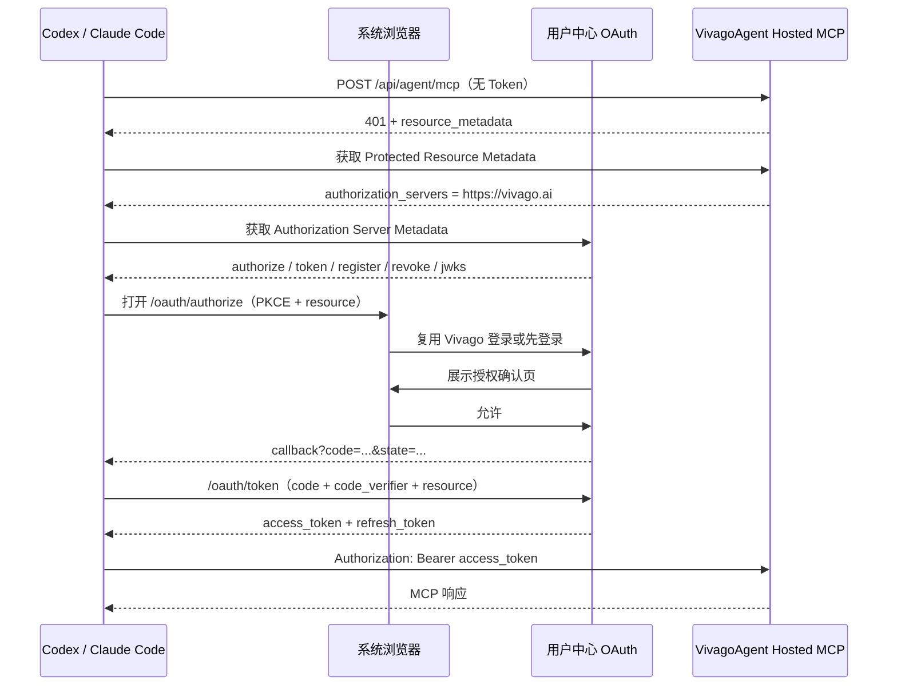

# Vivago Hosted MCP 标准 OAuth 接入方案（用户中心）

状态：待用户中心研发评审

日期：2026-08-05

对接方：用户中心、VivagoAgent、Web 前端、基础设施

## 背景

VivagoAgent 准备以 Hosted MCP 的方式公开接入 Codex、Claude Code 等 MCP Host。用户在 Host 中添加
`https://vivago.ai/api/agent/mcp` 后，需要通过 Vivago 官方账号登录，并明确允许 Host 代表自己访问
VivagoAgent。

用户中心负责浏览器登录、用户授权和 Token 签发；VivagoAgent 负责验证 Access Token，并继续使用现有的
项目、会话、任务、产物和套餐权限。OAuth 不替换现有 Web/App 登录，也不把 VivagoAgent 的业务权限逻辑
搬到用户中心。

第一版只设置一个权限：

```text
vivago.agent
```

这个权限允许 Host 查看用户自己的 Vivago 项目和历史、创建和执行任务，以及上传用户主动选择的文件。

## 方案概览

一句话设计：用户中心扩展为标准 OAuth Authorization Server，复用现有 Vivago 登录态完成用户确认，
通过 Authorization Code + PKCE 向 Codex/Claude Code 签发仅可访问 VivagoAgent MCP 的 Token。



固定标识如下，所有服务和客户端必须使用相同值：

| 名称 | 固定值 |
| --- | --- |
| Authorization Server Issuer | `https://vivago.ai` |
| MCP Resource / Token Audience | `https://vivago.ai/api/agent/mcp` |
| OAuth Scope | `vivago.agent` |
| Authorization Flow | Authorization Code + PKCE |
| PKCE Method | `S256` |
| Access Token 类型 | RS256 JWT |
| Access Token 有效期 | 15 分钟 |

## 用户中心需要提供哪些接口

### 对外接口

| 接口 | 是否为协议硬要求 | 用户中心第一版要求 |
| --- | --- | --- |
| `GET /.well-known/oauth-authorization-server` | 是，或提供 OIDC Discovery | 必须提供 |
| `GET /oauth/authorize` | 是 | 必须提供 |
| `POST /oauth/authorize/decision` | 行为必须，路径不是标准固定值 | 单独提供，处理允许/拒绝 |
| `POST /oauth/token` | 是 | 必须同时处理 code 和 refresh_token |
| `POST /oauth/register` | DCR 本身可选 | 为兼容不同 MCP Host，公开版提供 |
| `POST /oauth/revoke` | OAuth 撤销能力可选 | 正式公开版提供 |
| `GET /oauth/jwks` | JWT 方案需要 | 必须提供 |

VivagoAgent 另外提供：

```text
GET /.well-known/oauth-protected-resource/api/agent/mcp
```

这个接口不由用户中心开发，但用户中心需要共同确认其中的 `resource`、`authorization_servers` 和
`scopes_supported`。VivagoAgent 返回 401 时也会通过 `WWW-Authenticate` Header 指向该地址。

### Authorization Server Metadata

`GET /.well-known/oauth-authorization-server` 至少返回：

```json
{
  "issuer": "https://vivago.ai",
  "authorization_endpoint": "https://vivago.ai/oauth/authorize",
  "token_endpoint": "https://vivago.ai/oauth/token",
  "registration_endpoint": "https://vivago.ai/oauth/register",
  "revocation_endpoint": "https://vivago.ai/oauth/revoke",
  "jwks_uri": "https://vivago.ai/oauth/jwks",
  "response_types_supported": ["code"],
  "grant_types_supported": ["authorization_code", "refresh_token"],
  "code_challenge_methods_supported": ["S256"],
  "token_endpoint_auth_methods_supported": ["none"],
  "revocation_endpoint_auth_methods_supported": ["none"],
  "scopes_supported": ["vivago.agent"],
  "client_id_metadata_document_supported": true
}
```

第一版面向 Codex、Claude Code 这类 public client，不依赖客户端密钥。后续如果增加服务端 confidential
client，再单独支持 `private_key_jwt`，不在第一版混入 `client_secret_basic`。

## 登录和授权怎么处理

### 授权请求

典型请求：

```http
GET /oauth/authorize?
  response_type=code&
  client_id=https%3A%2F%2Fclient.example.com%2Foauth%2Fmetadata.json&
  redirect_uri=http%3A%2F%2F127.0.0.1%3A1455%2Fcallback&
  scope=vivago.agent&
  state=opaque-client-state&
  code_challenge=...&
  code_challenge_method=S256&
  resource=https%3A%2F%2Fvivago.ai%2Fapi%2Fagent%2Fmcp
```

用户中心收到请求后按以下顺序处理：

1. 校验 `client_id`，加载预注册、CIMD 或 DCR 客户端信息。
2. 校验 `redirect_uri` 与客户端登记值匹配。
3. 校验 `response_type=code`。
4. 校验 `code_challenge` 存在且 `code_challenge_method=S256`。
5. 校验 `resource` 精确等于 `https://vivago.ai/api/agent/mcp`。
6. 校验 `scope` 只能是 `vivago.agent`。
7. 将完整授权请求保存为短期授权事务，不能依赖浏览器提交隐藏字段作为可信数据。
8. 没有 Vivago 登录态时跳转现有登录页；登录完成后返回该授权事务。
9. 展示授权确认页，用户选择允许或拒绝。
10. 允许后生成一次性 Authorization Code，并带原 `state` 跳回客户端回调地址。

授权事务放在 Redis，TTL 10 分钟，使用 256 bit 随机 ID。事务至少保存：

```text
transaction_id
client_id
redirect_uri
scope
resource
state
code_challenge
code_challenge_method
created_at
expires_at
```

授权确认 POST 必须校验现有登录态、CSRF Token 和授权事务归属，不能相信页面回传的 `client_id`、
`redirect_uri`、`scope` 或 `resource`。

### 授权页面

前端复用现有登录页，只新增授权确认和失败页面。授权确认页展示：

- 客户端名称，例如 Codex、Claude Code；
- 客户端来源域名；
- 当前 Vivago 登录账号；
- 权限说明；
- “允许”和“取消”两个操作。

建议文案：

> 授权后，Codex 可以查看你的 Vivago 项目、创建和执行任务，以及上传你主动选择的文件。

客户端名称、主页和 Logo 都是外部数据，必须转义后展示，不能直接渲染外部 HTML。第一版不开发“已授权
应用管理”页面；撤销能力先由客服、安全后台或内部管理入口调用。

如果同一用户已经对同一 `client_id + resource + scope` 存在有效授权，可以跳过重复确认，但仍需生成
新的 Authorization Code。客户端、Resource 或 Scope 发生变化时必须重新确认。

### 拒绝和错误

用户主动拒绝时，跳回已经验证过的回调地址：

```text
?error=access_denied&state=<原 state>
```

如果 `client_id` 不合法或 `redirect_uri` 未通过校验，不能重定向到客户端提供的地址，只能在 Vivago 页面
显示错误。其他标准错误使用 `invalid_request`、`unauthorized_client`、`unsupported_response_type`、
`invalid_scope` 和 `server_error`。

## Client 注册

公开 MCP Host 可能使用三种方式，用户中心按以下优先级支持：

1. **预注册**：已知的 Codex、Claude Code 客户端可以配置固定 Client 信息。
2. **CIMD**：`client_id` 是 HTTPS metadata URL，用户中心获取并校验该 JSON。
3. **DCR**：兼容仍通过 `/oauth/register` 动态注册的 MCP Host。

### CIMD 校验

遇到 HTTPS URL 形式的 `client_id` 时：

- URL 必须为 HTTPS 且包含 path；
- metadata 中的 `client_id` 必须与 URL 完全一致；
- 必须包含 `client_name` 和 `redirect_uris`；
- 只允许 `grant_types=["authorization_code"]`；
- 第一版只接受 `token_endpoint_auth_method=none`；
- 按 HTTP Cache Header 缓存 metadata；
- 获取过程禁止访问内网 IP、云 metadata 地址和非 HTTPS 地址；
- 重定向后重新执行协议、域名和 IP 安全检查；
- 超时、响应大小、重定向次数和 JSON 深度必须设上限。

### DCR 请求

第一版只接受 public client：

```json
{
  "client_name": "Example MCP Host",
  "redirect_uris": ["http://127.0.0.1:1455/callback"],
  "grant_types": ["authorization_code"],
  "response_types": ["code"],
  "token_endpoint_auth_method": "none"
}
```

返回：

```json
{
  "client_id": "generated-client-id",
  "client_id_issued_at": 1785859200,
  "client_name": "Example MCP Host",
  "redirect_uris": ["http://127.0.0.1:1455/callback"],
  "grant_types": ["authorization_code"],
  "response_types": ["code"],
  "token_endpoint_auth_method": "none"
}
```

DCR 不签发可长期使用的 client secret。注册接口按 IP 和客户端指纹限流，并限制每个来源的有效客户端
数量，异常注册进入安全审计。

### Redirect URI 规则

- 普通回调必须是预先登记的 HTTPS URI，并进行完整字符串匹配；
- 本地原生客户端允许 `http://127.0.0.1:{port}/<registered-path>` 和 IPv6 loopback；
- loopback 可以使用动态端口，但 scheme、loopback host 和 path 必须与登记规则一致；
- 禁止通配域名、URL fragment、userinfo、非 loopback HTTP 地址；
- 是否额外兼容 `http://localhost` 需根据 Codex/Claude 实测结果决定，默认不接受。

## Authorization Code 和 Token

### Authorization Code

Authorization Code 使用至少 256 bit 随机值，TTL 5 分钟，只能使用一次。Redis 记录：

```text
code_hash
user_id
client_id
redirect_uri
scope
resource
code_challenge
code_challenge_method
grant_id
created_at
expires_at
consumed_at
```

数据库和日志均不保存明文 Code。消费 Code 必须原子完成，两个并发换 Token 请求只能有一个成功。

### Code 换 Token

请求使用 `application/x-www-form-urlencoded`：

```http
POST /oauth/token
Content-Type: application/x-www-form-urlencoded

grant_type=authorization_code&
code=...&
client_id=...&
redirect_uri=...&
code_verifier=...&
resource=https%3A%2F%2Fvivago.ai%2Fapi%2Fagent%2Fmcp
```

用户中心必须同时校验：Code 未过期且未消费、Client、Redirect URI、Resource 一致，以及
`BASE64URL(SHA256(code_verifier))` 等于授权时保存的 challenge。

成功返回：

```json
{
  "access_token": "<jwt>",
  "token_type": "Bearer",
  "expires_in": 900,
  "refresh_token": "<opaque-random-token>",
  "scope": "vivago.agent"
}
```

第一版不签发 OIDC `id_token`，MCP 也不需要用户资料接口。

### Access Token

Access Token 使用 RS256 JWT，包含：

```json
{
  "iss": "https://vivago.ai",
  "sub": "stable-non-pii-user-id",
  "aud": "https://vivago.ai/api/agent/mcp",
  "scope": "vivago.agent",
  "client_id": "...",
  "grant_id": "...",
  "jti": "...",
  "iat": 1785859200,
  "exp": 1785860100
}
```

`sub` 必须是稳定、不可复用且不直接包含邮箱、手机号等信息的用户 ID。Token 不写入昵称、邮箱、手机号、
套餐、角色等字段。VivagoAgent 使用 `sub` 识别用户，套餐和角色继续读取现有用户/订单数据。

RS256 私钥放在 KMS 或公司的密钥管理系统，不进入数据库、Nacos、代码仓库和普通环境变量。JWT Header
必须包含 `kid`。签名密钥默认每 90 天轮换；旧公钥至少保留到所有已签发 Access Token 过期并加上
时钟误差窗口。

### JWKS

`GET /oauth/jwks` 返回当前和仍处于验证窗口内的历史公钥：

```json
{
  "keys": [
    {
      "kty": "RSA",
      "use": "sig",
      "alg": "RS256",
      "kid": "oauth-2026-08",
      "n": "...",
      "e": "AQAB"
    }
  ]
}
```

JWKS 可以公开缓存，但必须在轮换期间保证新旧 Key 同时可取。VivagoAgent 按 `kid` 缓存公钥，遇到未知
`kid` 时刷新一次，仍不存在则拒绝 Token。

### Refresh Token

Refresh Token 使用至少 256 bit 随机值，只向客户端返回一次，数据库只保存 HMAC-SHA256 后的摘要。

固定规则：

- 30 天无活动过期；
- 最长 90 天绝对过期；
- 每次刷新签发新的 Access Token 和 Refresh Token；
- 旧 Refresh Token 立即标记为 `rotated`；
- 已 rotated 的 Token 再次出现时，按泄漏处理，撤销整个 Token Family；
- 用户、客户端、Grant 被禁用后不能继续刷新；
- 失败响应不得泄露 Token 是否真实存在。

刷新请求：

```http
POST /oauth/token
Content-Type: application/x-www-form-urlencoded

grant_type=refresh_token&
refresh_token=...&
client_id=...&
resource=https%3A%2F%2Fvivago.ai%2Fapi%2Fagent%2Fmcp
```

### 撤销授权

`POST /oauth/revoke` 接受 Access Token 或 Refresh Token：

```http
POST /oauth/revoke
Content-Type: application/x-www-form-urlencoded

token=...&token_type_hint=refresh_token&client_id=...
```

无论 Token 是否存在都返回 200，避免把接口变成 Token 探测器。撤销 Refresh Token 时撤销所属 Token
Family 和 Grant；撤销 Access Token 时至少撤销对应 Grant 的后续刷新。

为使已经签发的 15 分钟 JWT 能立即失效，用户中心需要把 `grant_id` 写入双方可读的短期撤销缓存，或
通过现有可靠消息机制通知 VivagoAgent。撤销记录保留到该 Grant 最晚可能存在的 Access Token 过期。
如果第一版暂时不接即时撤销通道，必须在上线说明中明确：已签发 JWT 最长仍可使用 15 分钟。

## 建议的数据结构

### `oauth_clients`

```text
id
client_id                      unique
registration_type              preregistered | cimd | dcr
client_name
client_uri
logo_uri
redirect_uris                  JSON
grant_types                    JSON
response_types                 JSON
token_endpoint_auth_method
metadata_url
status                         active | disabled
created_at
updated_at
last_used_at
```

`client_id` 唯一索引；DCR 客户端需要按 `created_at` 和来源 IP 支撑限流、清理和安全查询。

### `oauth_grants`

```text
id                             grant_id
user_id
client_id
resource
scope
status                         active | revoked
granted_at
last_used_at
revoked_at
revoke_reason
```

建议建立 `user_id + client_id + resource + scope + status` 索引，用于授权页判断是否已有有效 Grant。

### `oauth_refresh_token_families`

```text
id
grant_id
client_id
user_id
status                         active | revoked | compromised | expired
absolute_expires_at
last_rotated_at
revoked_at
revoke_reason
```

### `oauth_refresh_tokens`

```text
id
family_id
token_hash                     unique
status                         active | rotated | revoked
issued_at
expires_at
rotated_at
replaced_by_id
last_used_at
```

Token 查找必须走 `token_hash` 唯一索引；轮换和旧 Token 重放处理放在同一数据库事务中。

### `oauth_audit_logs`

至少记录：

```text
event_type
occurred_at
request_id
user_id
client_id
grant_id
source_ip_hash
user_agent_hash
result
error_code
```

禁止记录 Authorization Code、Access Token、Refresh Token、Cookie、Authorization Header、完整回调 Query
和预签名 URL。保留周期沿用公司安全审计规范；如果还没有统一规范，第一版按 180 天准备容量。

## VivagoAgent 如何验证 Token

用户中心与 VivagoAgent 的接口契约是 JWT 和 JWKS，不通过外部 Header 传用户身份，也不要求每个 MCP
请求回调用户中心。

VivagoAgent 每次请求至少校验：

- JWT 签名和 `kid`；
- `iss == https://vivago.ai`；
- `aud` 包含且只用于 `https://vivago.ai/api/agent/mcp`；
- `exp`、`iat`，允许最多 60 秒时钟误差；
- `scope` 包含 `vivago.agent`；
- `sub`、`client_id`、`grant_id`、`jti` 存在；
- `grant_id` 未被撤销。

校验成功后，VivagoAgent 构建：

```text
ActorContext
- user_id = sub
- client_id
- scopes = [vivago.agent]
- source = mcp
- platform = web
```

用户中心仍负责账号禁用、授权撤销和 Token 生命周期；VivagoAgent 仍负责项目归属、用户等级、套餐、并发、
资产访问和业务限流。

## 安全要求

- 所有 OAuth 接口只通过 HTTPS 提供；只有本机 loopback callback 可以使用 HTTP。
- Access Token 只能放在 `Authorization: Bearer` Header，不能放 Query、Cookie 或 MCP 参数。
- Authorization Code 必须一次性消费，并绑定 Client、Redirect URI、Resource 和 PKCE challenge。
- `resource` 必须同时出现在 authorize 和 token 请求中，并绑定到 Access Token 的 `aud`。
- 用户中心不能把其他系统的 Access Token 透传给 VivagoAgent。
- 授权页 POST 必须防 CSRF；登录事务和授权事务必须防 Session Fixation。
- 登录或授权完成后只能跳到已验证的 Redirect URI，不能使用任意 `returnUrl`。
- Token、Code 和 Cookie 必须经过统一日志脱敏；异常堆栈也不能打印请求体中的 Token。
- Token、Grant、Client 和授权事件都要带 `request_id`，方便跨服务排查，但不能把 Token 当作追踪 ID。
- `/oauth/register`、`/oauth/token`、CIMD 下载和授权失败按 IP、Client 限流。
- 系统时间必须通过 NTP 保持同步；用户中心和 VivagoAgent 的误差不得超过 60 秒。

## 第一版明确不做

- 不实现 OIDC `id_token`、UserInfo 和第三方社交登录协议扩展；
- 不实现 Device Authorization Grant、Implicit Grant、Password Grant、Client Credentials；
- 不拆分 read/run/upload 多个 Scope；
- 不开发用户侧“授权应用管理”页面；
- 不让插件或 Vivago 前端接收 OAuth callback、保存或刷新 Token；
- 不把套餐、角色、邮箱、手机号写进 Access Token；
- 不实现 OAuth Token Introspection，VivagoAgent 使用 JWT + JWKS 本地验证；
- 不更换现有 Web/App Cookie/Ticket 登录方式。

## 联调和验收

### 用户中心接口测试

- Metadata 字段完整，URL 与生产域名一致；
- 正常授权、已有 Grant 跳过重复确认、主动拒绝；
- 未登录进入登录页，登录后能恢复原授权事务；
- Code 换 Token、刷新 Token、Token 撤销；
- Code 过期、Code 重放、错误 verifier、缺失 PKCE；
- Client、Redirect URI、Scope、Resource 任一不匹配都被拒绝；
- Refresh Token 正常轮换，旧 Token 重放会撤销 Token Family；
- JWKS 新旧 Key 轮换期间均可验证；
- DCR、CIMD 和预注册客户端均能完成授权；
- CIMD 的内网访问、重定向绕过、超时和超大响应被拦截；
- 所有错误响应和日志都不包含 Token、Code、Cookie。

### Codex / Claude Code 真实联调

两种 Host 都必须从未登录状态完成：

1. 添加 `https://vivago.ai/api/agent/mcp`；
2. 自动发现 Vivago Authorization Server；
3. 打开浏览器完成登录和一次授权；
4. Host 自动用 Code + PKCE 换 Token；
5. 使用 Access Token 调用 MCP；
6. Access Token 过期后自动刷新；
7. 重启 Host 后仍能从安全存储恢复登录；
8. 撤销授权后，旧 Token 或 Refresh Token 不能继续使用。

仅验证登录页面成功或 `/oauth/token` 返回 200 不算联调完成，必须至少调用一次真实的 MCP Tool，并确认
VivagoAgent 识别到正确用户且无法访问其他用户的数据。

### 上线前完成标准

- 海外生产 Metadata、JWKS 和 OAuth Endpoint 可从公网访问；
- 授权页展示的 Client、账号和权限说明准确；
- Codex、Claude Code 使用生产回调完成真实任务；
- Token 签名私钥进入正式密钥管理系统；
- Token、Code、Cookie 日志脱敏检查通过；
- 用户中心与 VivagoAgent 对 Issuer、Resource、Scope、`sub` 和撤销语义的测试完全一致；
- OAuth authorize/token 成功率、错误码、Refresh Token 重放和撤销事件已有指标与告警；
- OAuth 可以通过 Feature Flag 关闭，且不影响现有 Vivago Web/App 登录。

## 研发评审需要确认的事项

1. 现有用户 ID 是否满足稳定、非邮箱/手机号、不会复用的 `sub` 要求；如果不满足，需要先增加 OAuth
   Subject 映射。
2. 用户中心生产域名是否可以直接承载 `/.well-known/*` 和 `/oauth/*`；如果由网关转发，外部 Metadata
   中仍必须全部使用 `https://vivago.ai`。
3. Codex、Claude Code 实测使用的 Client 注册方式和 loopback callback 形状；默认同时支持 CIMD、DCR
   和预注册，测试通过后再决定是否缩减。
4. JWT 撤销采用双方共享短期撤销缓存，还是通过现有可靠消息机制同步 `grant_id`；如果第一版两者都不做，
   需要接受最长 15 分钟的 Access Token 撤销延迟。
5. RS256 私钥在现有 KMS/密钥系统中的创建、轮换和应急回滚负责人。

## 参考规范

- [MCP Authorization 2025-11-25](https://modelcontextprotocol.io/specification/2025-11-25/basic/authorization)
- [RFC 8414: OAuth 2.0 Authorization Server Metadata](https://www.rfc-editor.org/rfc/rfc8414.html)
- [RFC 9728: OAuth 2.0 Protected Resource Metadata](https://www.rfc-editor.org/rfc/rfc9728.html)
- [RFC 7591: OAuth 2.0 Dynamic Client Registration](https://www.rfc-editor.org/rfc/rfc7591.html)
- [RFC 7636: Proof Key for Code Exchange](https://www.rfc-editor.org/rfc/rfc7636.html)
- [RFC 8707: Resource Indicators for OAuth 2.0](https://www.rfc-editor.org/rfc/rfc8707.html)
- [RFC 7009: OAuth 2.0 Token Revocation](https://www.rfc-editor.org/rfc/rfc7009.html)
- [RFC 9700: Best Current Practice for OAuth 2.0 Security](https://www.rfc-editor.org/rfc/rfc9700.html)
