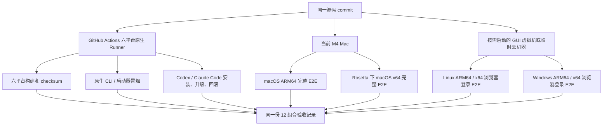

# VivagoAgent CLI 六平台双宿主测试环境设计

## 背景

VivagoAgent CLI 的插件包同时包含 macOS、Linux、Windows 的 ARM64 和 x64 二进制，支持
Codex、Claude Code 两个宿主。因此公开 Beta 前需要验证 6 个 OS/CPU 目标 × 2 个宿主，共
12 个组合。

这 12 个组合不能只靠 `GOOS/GOARCH` 交叉编译来证明。交叉编译只能说明二进制生成成功，不能证明
启动器选对了文件、宿主能安装插件、系统凭证库能工作、loopback 登录能回调、升级和回滚不会破坏
登录状态。

当前可用的本地机器是：

- MacBook Pro，Apple M4，ARM64；
- 10 核 CPU、16 GB 内存；
- macOS 26.5；
- Rosetta 已安装，可以启动 x86_64 macOS 进程；
- 尚未安装 Lima、UTM、Parallels、Docker 或 QEMU 等虚拟化工具。

在这台机器上维护六套完整虚拟机并不现实，也没有必要。本方案采用本机、轻量虚拟机和 GitHub
Hosted Runner 组合测试，不减少公开 Beta 的六平台支持范围。

相关设计：

- [GitHub 开发 CI 设计](./2026-08-07-vivago-agent-cli-github-development-ci-design.md)
- [Go CLI 与六平台插件公开 Beta 设计](./2026-08-07-vivago-agent-cli-go-public-beta-design.md)

## 采用什么方案

一句话方案：日常提交由 GitHub Actions 在六种原生 OS/CPU Runner 上完成构建、CLI 和插件安装
检查；当前 Mac 负责 macOS ARM64、macOS x64 和关键的真实登录 E2E；需要浏览器交互的 Linux、
Windows 用一台一台启动的本地 GUI 虚拟机或临时云机器补齐。

不建议为了“看起来覆盖完整”而让六个平台全部跑在本地模拟器里。x64 Linux 和 x64 Windows 在
Apple Silicon 上只能依靠全系统指令模拟，速度和稳定性都明显低于原生 Runner，测试失败时也很难
判断是 VivagoAgent CLI 的问题还是模拟器的问题。

## 先区分四种测试证据

测试报告必须记录通过的是哪一层，不能统一写成“六平台已通过”。

| 层级 | 证明什么 | 不能证明什么 | 运行频率 |
|---|---|---|---|
| L0 构建检查 | 六个目标能编译，文件、checksum、Manifest 和环境扫描正确 | 二进制能在目标系统启动 | 每次 Push / PR |
| L1 原生 CLI 冒烟 | 二进制在对应 OS/CPU 原生启动，启动器选择正确，JSON 输出兼容 | Codex/Claude Code 能完成安装和调用 | 手动六平台验证、开发版发布 |
| L2 双宿主安装 | 两个宿主能安装、发现、升级、回滚插件 | Vivago 网页登录和在线任务完整可用 | 每次开发版发布 |
| L3 在线完整 E2E | 登录、凭证、任务、SSE、附件、产物和生命周期可用 | 不能替代长期外部 Beta 观察 | Beta 候选发布前 |

公开 Beta 的六平台门槛仍然是 12/12，不因为机器条件有限而删掉 Windows ARM64 或其他组合。日常
开发不需要每次都运行昂贵的 L3；Beta 候选版本才执行完整矩阵。

## 六个平台分别怎么测

| OS/CPU | 本地做法 | GitHub 原生 Runner | Beta 前采用的证据 |
|---|---|---|---|
| macOS ARM64 | 当前 Mac 原生运行 | `macos-26` | 本地 L3 + CI L0/L1/L2 |
| macOS x64 | Rosetta 启动 x64 宿主和 CLI | `macos-26-intel` | 本地 Rosetta L3 + Intel Runner L0/L1/L2 |
| Linux ARM64 | UTM ARM64 GUI；日常冒烟也可用 Lima | `ubuntu-24.04-arm` | CI L0/L1/L2 + UTM/云端 L3 |
| Linux x64 | 不建议在本机长期全系统模拟 | `ubuntu-24.04` | CI L0/L1/L2 + 临时云机或一次性 UTM L3 |
| Windows ARM64 | UTM/Parallels Windows 11 ARM，串行运行 | `windows-11-arm` | CI L0/L1/L2 + GUI 虚拟机或自动浏览器 L3 |
| Windows x64 | 不建议在 M4 上长期模拟 | `windows-latest` 或 `windows-2025` | CI L0/L1/L2 + 临时云机 L3 |

GitHub 当前为公开和私有仓库提供上述 ARM64/x64 Runner。私有仓库会消耗账号套餐中的 Actions
分钟数，用完后按 GitHub 计费。Runner 标签和支持状态以 GitHub 官方文档为准：

- [GitHub-hosted runners reference](https://docs.github.com/en/actions/reference/runners/github-hosted-runners)
- [Linux / Windows ARM64 private runner announcement](https://github.blog/changelog/2026-01-29-arm64-standard-runners-are-now-available-in-private-repositories/)
- [macOS 26 ARM64 / Intel runner announcement](https://github.blog/changelog/2026-02-26-macos-26-is-now-generally-available-for-github-hosted-runners/)

### macOS ARM64

当前 Mac 是这一行的主要人工验证环境。Codex 和 Claude Code 使用各自独立的测试配置，避免读取日常
插件、会话和仓库配置。

这一行执行完整 L3：

- 全新安装开发 Marketplace；
- 首次网页登录；
- 创建项目和文本任务；
- `input_required`、SSE 恢复、取消和历史；
- 附件上传、产物下载和本地预览；
- 宿主重启、插件升级、插件回滚；
- logout 后重新登录；
- 验证 `source=cli`、`platform=web` 和开发环境项目链接。

### macOS x64

本地不安装 Intel macOS 虚拟机。Rosetta 可以让当前 M4 Mac 运行 x86_64 macOS 进程，因此本地验证时
要保证宿主、启动器以及最终选择的 `darwin-amd64/vivago-agent` 都运行在 x86_64 进程树中。

Rosetta 测试适合发现以下问题：

- 启动器把 `x86_64` 错选成 ARM64；
- x64 CLI 不能启动或 JSON 输出不兼容；
- x64 Codex/Claude Code 找不到插件脚本；
- Keychain、loopback callback、升级和回滚在 x64 进程中异常。

Rosetta 不能证明 Intel Mac 的所有系统差异，因此 CI 还要在 `macos-26-intel` 上执行原生 x64 的
L0/L1/L2。Apple 对 Rosetta 和虚拟化限制的说明见：

- [About the Rosetta translation environment](https://developer.apple.com/documentation/Apple-Silicon/about-the-rosetta-translation-environment)

### Linux ARM64

如果只验证 CLI、启动器和插件文件，优先使用 Lima：它轻量、免费、适合命令行自动化。

如果要验证真实 `/agent/login`，优先使用 UTM 安装带桌面的 ARM64 Linux。浏览器必须运行在虚拟机
内部，因为登录页面最终向浏览器所在系统的 `127.0.0.1:<port>` 提交 Form POST。直接在宿主 Mac
浏览器打开虚拟机打印的登录 URL，请求会回到 Mac，不会回到虚拟机里的 CLI。

建议配置：2 个 vCPU、4 GB 内存、30～40 GB 磁盘。测试时只启动这一台虚拟机。

### Linux x64

Apple Virtualization Framework 可以在 ARM64 Linux Guest 中借助 Rosetta 运行部分 x86_64 Linux
二进制，但 Guest 仍然是 ARM64 Linux，这只能作为额外的 CLI 冒烟，不能记为完整 Linux x64 证据：

- [Running Intel Binaries in Linux VMs](https://developer.apple.com/documentation/virtualization/running-intel-binaries-in-linux-vms)

Linux x64 的标准检查放在 `ubuntu-24.04`。Beta 前的真实浏览器登录可以选以下一种：

1. 临时启动一台带桌面的 x64 Linux 云主机，完成后销毁；
2. 在受保护的手动 GitHub Actions 中，用专用测试账号和同机 headless browser 完成 loopback 登录；
3. 条件实在有限时，一次性使用 UTM/QEMU 全系统模拟，但不作为长期 CI。

默认选择第 1 种。它比在 M4 上模拟完整 x64 系统更容易判断问题，也方便人工观察浏览器和宿主行为。

### Windows ARM64

Windows ARM64 首先使用 `windows-11-arm` 做原生 L0/L1/L2。需要人工查看登录页、Credential Manager
或宿主界面时，再启动 Windows 11 ARM GUI 虚拟机。

本机工具选择：

- UTM：免费，适合低频测试；
- Parallels：付费，但 Windows ARM 的安装、驱动和桌面体验更省时间。

当前机器只有 16 GB 内存，Windows ARM 建议分配 4 个 vCPU、6～8 GB 内存和至少 64 GB 磁盘，
运行时关闭其他虚拟机。

### Windows x64

Windows x64 不在当前 M4 Mac 上做日常全系统模拟。标准检查使用 `windows-latest` 或
`windows-2025`，完整 L3 使用临时 Windows x64 云主机，通过 RDP 在机器内部完成两个宿主和浏览器登录。

Windows 行必须使用原生 PowerShell/CMD/Git Bash 启动插件，确认 `.cmd` 选择 Windows 二进制并使用
Credential Manager。WSL 中运行的 Codex/Claude Code 会选择 Linux 二进制，最多计入 Linux x64 或
Linux ARM64，不能记作 Windows 测试。

Codex 当前官方文档支持 Windows 原生 PowerShell 和 Windows sandbox，并建议使用 Windows 11；
Claude Code 官方文档支持 Windows 10 1809+ 的 x64/ARM64，并同时提供原生 Windows 与 WSL 两种模式：

- [Codex Windows sandbox](https://developers.openai.com/codex/windows)
- [Claude Code advanced setup](https://docs.anthropic.com/en/docs/claude-code/getting-started)

## GitHub Actions 怎么分层

### PR 和普通 Push

这类工作流不读取任何线上账号或凭证，固定使用 `contents: read`，运行：

1. 默认与 `prod` Go test、Race、Vet；
2. 六个平台交叉构建、checksum 和环境地址扫描；
3. 组装 Codex/Claude Code 插件并运行官方/本地校验器；
4. 验证 stdout 仍为机器可读格式，stderr 不包含凭证、预签名 URL 和 Authorization；
5. 上传不含凭证的开发制品。

来自 Fork 的 PR 绝不执行在线登录或宿主调用，也不获得 Actions Secrets。

为了避免个人私有仓库的免费 Actions 分钟被每次 Push 消耗，六个原生 Runner 的 L1 只在手动运行
`Development CI` 时启动。六个 Runner 下载同一次 Ubuntu 构建生成的 Marketplace，分别通过插件启动器
执行 `version` 和 `doctor`，核对实际 OS/CPU、版本、源码 SHA、dev profile 和凭证后端，然后上传不含
登录信息的 JSON 报告。仓库转为公开仓库后，标准 GitHub-hosted Runner 免费；届时再根据运行耗时决定
是否改成主分支每次合并自动执行。

### 开发版发布

发布 `0.3.0-dev.N` 时执行 L2：

- 每个原生 Runner 使用临时、独立的宿主配置目录；
- 分别安装 Codex 和 Claude Code；
- 从当前 commit 组装的开发 Marketplace 全新安装插件；
- 确认宿主能够发现 Skill 和对应平台 CLI；
- 从上一开发版升级到当前版；
- 回滚到上一版，再升级回当前版；
- 删除临时目录，不上传宿主账号和系统凭证目录。

如果某个宿主在特定 Runner 上暂时没有可用的原生安装包，该组合必须标为 `BLOCKED` 并记录宿主版本、
官方支持说明和错误日志，不能用“CLI 二进制能运行”替代宿主安装通过。

### Beta 候选版在线 E2E

在线 E2E 使用单独的 `workflow_dispatch` 或人工测试批次，不能挂在外部 PR 上。需要满足：

- 只访问海外测试环境；
- 使用专用、可撤销、无生产数据的 Vivago 测试账号；
- Codex、Claude Code 的测试凭证放在 GitHub Protected Environment 中，触发时需要人工审批；
- 每个测试账号设置 `concurrency: 1`，避免两个 Runner 同时刷新或覆盖凭证；
- Runner 结束前删除本地测试凭证，Actions Artifact 不包含 Keychain、Credential Manager、Secret
  Service 或 Linux 凭证文件；
- 日志和截图不能出现 ticket、refresh token、Cookie、Authorization、Prompt、本地文件内容或完整
  预签名 URL；
- 不给正式 CLI 增加 `--token`、`--env` 或绕过网页登录的测试后门。

真实登录有两种执行方式：

1. **人工 GUI 登录**：在本地/临时云虚拟机内部打开浏览器，适合第一轮和问题排查；
2. **同机浏览器自动化**：浏览器和 CLI 都运行在同一个 GitHub Runner 上，loopback callback 才能正确
   返回。只有海外测试账号具备稳定、可自动化且不依赖第三方 MFA/CAPTCHA 的登录方式时才启用。

如果现有登录方式不能安全自动化，就保留人工 GUI 登录，不为节省测试机器而削弱登录安全设计。

## 12 个组合怎么验收

每个组合使用唯一 Case ID：

| Case ID | OS/CPU | 宿主 |
|---|---|---|
| M-A-C | macOS ARM64 | Codex |
| M-A-CC | macOS ARM64 | Claude Code |
| M-X-C | macOS x64 | Codex |
| M-X-CC | macOS x64 | Claude Code |
| L-A-C | Linux ARM64 | Codex |
| L-A-CC | Linux ARM64 | Claude Code |
| L-X-C | Linux x64 | Codex |
| L-X-CC | Linux x64 | Claude Code |
| W-A-C | Windows ARM64 | Codex |
| W-A-CC | Windows ARM64 | Claude Code |
| W-X-C | Windows x64 | Codex |
| W-X-CC | Windows x64 | Claude Code |

每个 Case 的记录至少包含：

- 源码 commit、插件版本、Marketplace ref；
- Runner/虚拟机的 OS 版本和 CPU 架构；
- Codex 或 Claude Code 版本；
- 实际启动的 CLI 文件路径、`version` 输出中的 OS/CPU/profile；
- L0、L1、L2、L3 各自的 `PASS / FAIL / BLOCKED / NOT_RUN`；
- 失败步骤、脱敏日志、Issue 链接和复测结果；
- 测试时间和执行人。

L3 按公开 Beta 主方案执行以下步骤：

1. 从个人 GitHub 开发 Marketplace 全新安装插件；
2. 从未登录状态完成海外测试网页登录；
3. 创建项目并提交文本任务，收到 `RUN_FINISHED`；
4. 上传至少一种本地附件；
5. 处理 `input_required` 并继续同一 Conversation；
6. 人为断开 SSE，使用原 `turn_id` 和 `last_event_id` 恢复；
7. 验证取消和历史查询；
8. 下载并本地预览图片、音频或视频产物；
9. 重启宿主，确认登录态仍有效；
10. 升级和回滚插件，确认登录态仍有效；
11. logout 后再次调用并完成重新登录；
12. 验证 `project link`、`source=cli` 和 `platform=web`。

Beta 候选版本只有在 12 个 Case 的 L0/L1/L2/L3 都是 `PASS` 时才记为 12/12。Rosetta、翻译执行、
容器或 WSL 必须在记录中写明，不能伪装成原生 OS 证据。

## 本地虚拟机怎么控制成本

### 推荐安装顺序

不一次性准备四台虚拟机，按问题和版本阶段逐步增加：

1. 先完成本机 macOS ARM64 与 Rosetta macOS x64；
2. 安装 UTM，先建立 Linux ARM64 GUI 模板；
3. 需要 Windows ARM64 人工登录时，再建立 Windows 11 ARM 模板；
4. Linux x64、Windows x64 默认使用临时云机，不在本地长期保存；
5. 只有云资源不可用时，才临时创建 UTM/QEMU x64 模拟机。

### 资源限制

- 同一时间只启动一台虚拟机；
- Linux ARM64 分配 2 vCPU、4 GB RAM；
- Windows ARM64 分配 4 vCPU、6～8 GB RAM；
- 虚拟机磁盘使用稀疏镜像，并在每轮测试前从干净快照恢复；
- 不在虚拟机中保存个人 GitHub、公司 GitHub或海外正式环境凭证；
- 每个插件版本只保留基线快照和脱敏测试报告，失败现场按需短期保留。

### 为什么不把 Docker 当成完整方案

Docker 可以补 Linux 命令和文件系统兼容测试，但不能覆盖：

- macOS Keychain；
- Windows Credential Manager 和 `.cmd` 启动器；
- 两个宿主的原生插件目录；
- GUI 浏览器向本机 loopback Form POST；
- macOS/Windows 的升级、回滚和权限行为。

因此 Docker 只能补 L0/L1，不能替代六平台双宿主矩阵。

## 失败怎么判断

常见失败按责任分组，避免把环境故障算成 CLI 缺陷：

| 失败位置 | 先检查什么 | 记录方式 |
|---|---|---|
| Runner 未创建 | GitHub 套餐、Runner 标签、并发额度 | `BLOCKED`，不计 CLI FAIL |
| 宿主无法安装 | 宿主是否正式支持该 OS/CPU、安装包版本 | `BLOCKED` 或宿主兼容 Issue |
| 启动器选错二进制 | OS/CPU 探测和脚本路径 | CLI `FAIL` |
| CLI 无法启动 | 架构、动态依赖、文件权限 | CLI `FAIL` |
| 浏览器回调不到 CLI | 浏览器与 CLI 是否在同一系统、端口和 state | 环境或登录 `FAIL` |
| 凭证无法保存 | Keychain/Credential Manager/Secret Service 状态 | CLI `FAIL`，Linux 可验证文件降级 |
| 宿主未调用 Skill | Manifest、Skill 路径、宿主版本和提示词 | 插件 `FAIL` |
| 任务无终态 | request ID、turn ID、last event ID 和服务端状态 | 服务端/网络 Issue，保留可恢复游标 |

`BLOCKED` 不等于 `PASS`。公开 Beta 前，必须消除或由产品明确移除对应平台支持，不能把未执行的 Case
写成“通过”。

## 实施顺序和工作量

以下按一名研发借助 Codex、测试账号和 GitHub 权限可用估算，不包含修复新发现的平台缺陷：

| 工作 | 预计时间 | 产出 |
|---|---:|---|
| 建立测试 Case 和机器可读结果格式 | 0.5 人日 | 12 Case 台账和结果模板 |
| GitHub 六个原生 Runner 的 L0/L1 | 1～2 人日 | 六平台原生 CLI 报告 |
| Codex/Claude Code L2 安装、升级、回滚 | 1～2 人日 | 12 个宿主安装结果 |
| 本机 macOS ARM64 + Rosetta x64 L3 | 0.5～1 人日 | 4 个组合完整记录 |
| Linux ARM64 UTM 环境和 L3 | 0.5～1 人日 | 2 个组合完整记录 |
| Linux x64、Windows ARM64/x64 的 L3 | 1.5～3 人日 | 剩余 6 个组合完整记录 |
| 汇总、复测和发布门禁 | 0.5～1 人日 | 12/12 Beta 候选报告 |

环境准备和测试流程合计约 **4.5～8.5 人日**。如果 GitHub Runner 上的浏览器登录可以安全自动化，
后续每个开发版只需约 1～2 小时机器时间和少量人工审批；如果必须人工 GUI 登录，完整 Beta 候选矩阵
预计占用 1～2 个工作日。

平台缺陷修复单独估算，不应把修复时间隐藏在环境准备时间中。

## 开始前要确认什么

在实现 GitHub 六平台测试前确认：

1. 个人 GitHub 仓库已启用 Actions，并能使用六个 Runner 标签；
2. Codex 和 Claude Code 在 CI 中允许安装的版本范围；
3. 开发版 Marketplace 上一版本和当前版本，供升级/回滚测试；
4. GitHub Protected Environment 中是否允许放置专用的 Codex、Claude Code 测试凭证；
5. 海外测试 Vivago 账号是否有可自动化的邮箱登录方式；如果没有，L3 固定走人工 GUI；
6. 临时 Linux x64、Windows x64 云主机由谁创建和销毁；
7. Windows ARM64 如果无法完成宿主原生安装，是否先记录为宿主阻断并向官方确认，而不是用 WSL
   冒充通过。

当前不需要购买六台机器，也不需要一次安装四套虚拟机。可以先直接实施 GitHub 六平台 L0/L1 和本机
macOS 两种架构的 L3；UTM 与临时云机只在进入对应平台在线 E2E 时准备。

## 当前实施状态（2026-08-07）

- 普通 CI 已完成六目标交叉构建、Marketplace 组装、checksum、环境地址和两个插件 Manifest 校验；
- `Development CI` 已增加仅限 `workflow_dispatch` 的六平台原生 L1 矩阵；
- 原生验证脚本会安全解压同一构建产物，通过包内启动器执行 `version` 和 `doctor`，验证启动器没有在
  ARM64/x64 共存时选错二进制；
- 每个平台上传独立的脱敏 JSON 报告，报告不保存登录状态、凭证内容或系统凭证目录；
- 开发版发布工作流已增加 6 平台 × Codex/Claude Code 的 12 个 L2 Job，固定使用 Codex
  `0.147.0` 和 Claude Code `2.1.220`；每个 Job 使用隔离宿主目录执行上一开发版安装、候选版升级、
  上一版回滚和候选版再次升级，并运行缓存插件内的对应平台 launcher；
- `publish` 必须等待 12 个 L2 Job 全部通过后才能更新 `dev-marketplace` 和创建 GitHub Prerelease；
- `v0.3.0-dev.4` 已在个人 GitHub 的
  [Manual Development Release #31190779125](https://github.com/ChaoXia-Beginer/vivago-agent-cli/actions/runs/31190779125)
  完成六平台 × 两宿主 L2 远程矩阵。12 个 Job 全部通过，验证源码为
  `1cea0d433c84d0105853b976cbd9a3822fc5c05f`；
- 12 份脱敏报告均为 `ok=true`，固定使用 Codex `0.147.0`、Claude Code `2.1.220`，并完整执行
  `0.3.0-dev.3` 安装、`0.3.0-dev.4` 升级、`0.3.0-dev.3` 回滚和 `0.3.0-dev.4` 再次升级；
- 发布门禁通过后已更新 `dev-marketplace` 并创建
  [`v0.3.0-dev.4` GitHub Prerelease](https://github.com/ChaoXia-Beginer/vivago-agent-cli/releases/tag/v0.3.0-dev.4)；
- L2 当前为 12/12，但这不代表公开 Beta 总矩阵 12/12。L3 在线完整 E2E 尚未执行。

## 发布门槛

开发版可以在以下条件下发布给内部测试：

- 六个平台 L0/L1 全部通过；
- 当前 Mac 的 Codex、Claude Code 两个宿主完成 macOS ARM64 L2/L3；
- 其他组合未完成时在 Release Note 中明确写为未验证，不能称为公开 Beta。

公开 Beta 候选版必须满足：

- 12 个组合 L0/L1/L2/L3 全部通过；
- 测试使用的源码 commit 与公司 GitHub 重新构建的 commit 一致；
- 公司 CI 使用 `prod` profile 重新构建，不复用个人 GitHub 二进制；
- 海外正式环境再完成一次受控的登录、文本任务、SSE 终态和 logout 冒烟；
- 测试报告无凭证、Prompt、本地文件内容和完整预签名 URL；
- Critical/High 安全问题为 0。

这套方案解决的是“条件有限时如何得到可信的六平台证据”，不是减少支持平台。最终的判断标准仍然是：
目标架构上能运行、两个宿主能安装、真实用户链路能完成、升级和回滚不丢登录状态。
