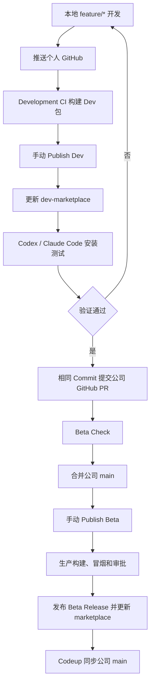

# VivagoAgent CLI 公开 Beta 发布设计

日期：2026-08-11

## 背景

`vivago-agent-cli` 已经具备 Go CLI、Codex/Claude Code 插件、六平台二进制、开发版
Marketplace 和海外测试环境验证能力。VivagoAgent 继续拥有 Project、Conversation、Turn、
历史和产物；插件只把宿主中的粗粒度任务交给 VivagoAgent，不暴露业务 MCP 工具，也不在
本地保存第二份会话历史。

下一步不是继续增加 CLI 功能，而是建立公司 GitHub 的公开 Beta 发布通道。公开 Beta 面向
所有现有 Vivago 用户，安装包连接海外生产环境；个人 GitHub 继续作为 Dev 测试通道，连接
海外测试环境。两条通道使用同一套源码，但不能共享二进制，也不能通过运行时参数切换环境。

## 已确认的发布模型

### 一句话设计

个人 GitHub 只能构建和发布 Dev 测试版，公司 GitHub 只能构建和发布生产 Beta；环境、版本
通道和 Marketplace 名称由仓库身份与编译 profile 固定，发布人员没有选择环境的输入框。

```text
个人 GitHub
  -> Dev CI
  -> 海外测试环境
  -> v0.3.0-dev.N
  -> dev-marketplace

公司 GitHub
  -> Beta CI
  -> 海外生产环境
  -> v0.3.0-beta.N
  -> marketplace
```

这里的 `v0.3.0-dev.N` 和 `v0.3.0-beta.N` 是版本序列的写法，`N` 表示递增数字。实际
Tag 是 `v0.3.0-dev.7`、`v0.3.0-beta.1` 等，不存在名为 `N` 的分支或 Tag。

## 当前基础

| 能力 | 当前状态 |
|---|---|
| Go CLI 核心命令 | 已完成 |
| Codex / Claude Code 插件 | 已完成 |
| 六平台二进制构建 | 已完成 |
| 个人 GitHub Development CI | 已完成 |
| `dev-marketplace` 开发安装通道 | 已完成 |
| `v0.3.0-dev.N` 开发版发布 | 已完成 |
| 六平台乘两个宿主安装、升级、回滚门禁 | 已完成 |
| 海外测试环境 ticket-only L3 | 12/12 通过 |
| 登录、刷新、退出和本地凭证存储 | 已实现，代表平台已联调 |
| 联网图片搜索 | 已支持 |
| `Project`、`Conversation`、`Turn.source=cli` | 服务端已完成 |
| `platform=web` 和 Web 可见性设计 | 已确定 |
| 生产 `prod` profile | 已存在 |
| 公司 GitHub 仓库和 Beta CI | 公司私有仓库和 Workflow 已建立；PR #1 的 Beta Check 全绿，六平台原生 6/6、双宿主生命周期 12/12 |
| 生产 Beta 构建、组装和校验脚本 | 已实现并完成本地验证 |
| 海外生产受控冒烟 | 未完成 |
| 公开仓库治理和安全材料 | 核心仓库文件已完成；公司法定主体、产品政策入口和仓库规则待确认 |

现有 `ci.yml`、`dev-release.yml` 和 `hosted-l3.yml` 都属于 Dev 通道。现有 CI 虽然会运行
`go test -tags prod ./...`，但真正组装出来的仍然是 Dev 二进制和 `vivago-dev`
Marketplace，不是可以对外发布的生产 Beta 包。

## 仓库和分支

### 本地 Remote

公司仓库建立后，本地保留一个工作目录和三个 Remote：

```text
本地 vivago-agent-cli
|
|-- origin
|   `-- HiDream-ai/vivago-agent-cli
|
|-- personal
|   `-- ChaoXia-Beginer/vivago-agent-cli
|
`-- codeup
    `-- Codeup/vivago-agent-cli
```

| Remote | 用途 |
|---|---|
| `origin` | 公司 GitHub，对外源码和 Beta 发布的权威仓库 |
| `personal` | 个人 GitHub，Dev 构建、安装和测试 |
| `codeup` | 公司内部镜像、旧历史和恢复点 |

Remote 调整只写当前仓库的 `.git/config`，不修改 Git 全局配置、系统凭证助手或其他仓库。
默认 `git push` 推送公司 GitHub；需要触发个人 Dev CI 时显式推送 `personal`；公司 `main`
确认后再同步 Codeup。

### 长期分支和 Tag

```text
公司 GitHub
|-- 分支
|   |-- main
|   `-- marketplace              # CI 生成
`-- Tags / Releases
    |-- v0.3.0-beta.1
    `-- v0.3.0-beta.2

个人 GitHub
|-- 分支
|   |-- main
|   `-- dev-marketplace          # CI 生成
`-- Tags / Releases
    |-- v0.3.0-dev.7
    `-- v0.3.0-dev.8

Codeup
|-- main
`-- archive/*
```

源码开发使用临时 `feature/*` 和 `fix/*`，合并后删除。不维护永久 `develop`、`dev` 或
`prod` 源码分支。`dev-marketplace` 和 `marketplace` 是安装产物分支，只允许 CI 写入，
开发人员不在上面修改源码。

个人仓库的 `main` 跟随公司 `main`，未合并的开发工作放在个人仓库临时 `feature/*`。这样既能
在个人 CI 中生成 Dev 测试版，又不会把个人 `main` 变成另一条长期源码主线。

公司仓库使用经过审计的 Go 源码树建立干净初始历史，不复制当前仓库中包含旧 Pilot 的完整
祖先历史，也不复制个人 GitHub 的开发二进制、`dev-marketplace` 或旧 Dev Release。

## 为什么按仓库隔离发布

| 方案 | 主要问题 | 选择 |
|---|---|---|
| 一个 Workflow 通过参数选择 Dev/Prod | 个人仓库可能误选生产环境，审计时也难判断制品来源 | 不采用 |
| 用永久 `dev`、`prod` 源码分支区分环境 | 分支容易长期漂移，修复和回滚容易漏合并 | 不采用 |
| 个人和公司仓库各自固定发布通道 | 仓库身份、环境、版本和权限可以失败关闭 | 采用 |

Dev 和 Beta Workflow 都要校验准确的 `github.repository`。个人仓库只能接受 `-dev.N`
版本，公司仓库只能接受 `-beta.N` 版本。仓库更名后流水线先失败，修改并评审发布策略后才能
恢复，不自动降级到另一通道。

Workflow 不接受以下输入：

- build profile；
- API、Web 或登录地址；
- Marketplace 名称；
- Release channel；
- 个人 GitHub 已构建的 Artifact。

## 开发到发布的路径



个人 GitHub 可以从临时 `feature/*` 发布 Dev 版本，但 Release 必须记录完整源码 SHA。公司
Beta 只能从公司仓库 `main` 的已评审提交发布。

## 个人 GitHub CI

### Development CI

Pull Request、Push 或手动运行时执行：

- 默认和 `prod` Go 测试；
- Race、Vet 和 Python 分发测试；
- 六平台 Dev 二进制构建；
- Codex 和 Claude Code 插件校验；
- checksum、来源和环境地址扫描；
- 上传保留 14 天的临时 Artifact。

自动 CI 使用只读权限，不创建 Tag、Release 或 Marketplace 提交，也不访问生产环境。普通 Push
只表示“这次代码可以生成一个 Dev 候选包”，不等于发布 Dev 版本。

### Publish Dev

手动输入 `0.3.0-dev.N` 后重新执行完整门禁。六平台乘两个宿主生命周期验证通过，才允许：

- 创建不可变 `v0.3.0-dev.N` Tag；
- 创建 GitHub Prerelease；
- 以普通快进提交更新 `dev-marketplace`；
- 分发只连接海外测试环境的插件。

发布失败时不得部分覆盖 `dev-marketplace`，也不得移动已有 Tag。

## 公司 GitHub CI

### Beta Check

公司 Pull Request、Push 到 `main` 或手动运行时执行只读检查：

- 默认和 `prod` Go 测试、Race、Vet；
- 六平台生产二进制构建和原生启动检查；
- 六平台乘 Codex/Claude Code 的安装、升级和回滚；
- 官方插件校验；
- 生产地址、开发地址和敏感信息扫描；
- 依赖漏洞和许可证检查；
- checksum、SBOM 和构建来源检查。

Beta Check 不创建 Tag 或 Release，也不修改 `marketplace`。

### Publish Beta

`Publish Beta` 只允许在公司仓库 `main` 手动运行，输入 `0.3.0-beta.N`。执行顺序固定：

1. 验证仓库必须是 `HiDream-ai/vivago-agent-cli`。
2. 验证选中的源码 SHA 属于公司 `main`，并记录完整 SHA。
3. 验证版本符合 `0.3.0-beta.N`，且远端不存在同名 Tag。
4. 重新执行完整 Beta Check，不信任其他 Workflow 的旧二进制。
5. 使用 `-tags prod` 构建六平台二进制。
6. 组装并独立校验生产 Marketplace。
7. 执行海外生产环境受控冒烟。
8. 等待 GitHub `production-beta` Environment 人工批准。
9. 创建不可变 Tag 和 GitHub Prerelease。
10. 使用普通快进提交更新 CI 生成的 `marketplace`。
11. 上传 checksum、SBOM 和构建证明。

Push 到公司仓库不会直接给外部用户发布。只有手动运行 `Publish Beta` 并通过生产审批，才会
改变公开安装通道。

发布过程需要可恢复：Release 已创建但 Marketplace 更新失败时，旧 Marketplace 继续可用；
修复任务只能基于相同版本和源码 SHA 补完剩余步骤，不能覆盖另一个构建结果。

## Dev 和 Beta 构建隔离

| 构建 | Go 参数 | API/Web | 登录页 | Marketplace |
|---|---|---|---|---|
| Dev | 默认构建 | `https://dev.vivago.ai` | `https://dev.vivago.ai/agent/login` | `vivago-dev` |
| Beta | `-tags prod` | `https://vivago.ai` | `https://vivago.ai/agent/login` | `vivago` |

这里的隔离只用于防止测试流量进入生产、生产流量进入测试，不用于制造两套产品。个人 Dev 包与
公司 Beta 包遵守同一份产品契约：命令、参数、返回结构、Skill、references、启动器、支持平台、
宿主交互、登录/刷新/退出能力、名称和描述完全一致。包括 `auth refresh` 在内的命令不能按 profile
增删；编译 profile 只允许提供环境身份。

允许不同的字段只有：

| 类别 | Dev | Beta | 原因 |
|---|---|---|---|
| API、Web、登录地址 | 海外测试 | 海外生产 | 唯一产品环境差异 |
| 凭证和锁命名空间 | `dev` | `prod` | 防止跨环境复用凭证 |
| 版本后缀 | `-dev.N` | `-beta.N` | 安装、升级和回滚识别 |
| Marketplace 内部名称 | `vivago-dev` | `vivago` | 防止两个安装通道冲突 |
| 构建来源元数据 | `channel=dev/profile=dev` | `channel=beta/profile=prod` | 审计和环境门禁 |
| Release 治理附件 | 开发通道按需保留 | Beta 强制 SBOM/attestation | 发布治理，不改变插件功能 |

除上表外，不接受任何用户可见或运行时能力差异。自动化测试会同时组装 Dev/Beta 包，归一化上述
允许字段后逐文件比较 manifest、Skill、references、启动器、素材和法律文件；Go profile 的结构
也只允许保留环境名称和三个地址字段。

插件源码中的 Codex 和 Claude manifest 是环境无关模板，模板版本统一为 `0.0.0`。Codex
`interface.displayName`、Codex Marketplace 的 `interface.displayName`，以及 Skill 的
`agents/openai.yaml` 显示名，在源码、Dev 包和 Beta 包中均统一为 `Vivago Agent CLI`；Dev/Beta
的差异不再通过显示名表达，而由版本、Marketplace 内部名称、编译 profile 和服务地址表达。

两个组装器都必须显式覆盖两个 manifest 的版本，并显式写入 Codex 显示名，不能依赖模板当时
恰好具有正确值。Claude manifest 除动态版本外保持模板原样。Beta 组装和独立校验还必须确认：

- Codex 与 Claude manifest 的版本都精确等于本次 `X.Y.Z-beta.N`；
- Codex 的 `name`、顶层 `description`、`displayName`、短描述和长描述不含 `Dev`、
  `development` 或“开发”字样；
- Claude 的 `name` 和 `description` 不含上述开发字样；
- Codex `displayName` 精确为 `Vivago Agent CLI`。
- Skill 元数据的显示名精确为 `Vivago Agent CLI`，Skill 和 references 不含开发通道文案；
- 组装时忽略 `.DS_Store`、`__pycache__` 和 `.pyc` 等本机或解释器临时文件。

Beta 增加独立入口，不把现有 Dev 脚本改成一个接收 `--profile` 的万能脚本：

```text
build_dev_binaries.py
build_beta_binaries.py

assemble_dev_distribution.py
assemble_beta_distribution.py

verify_dev_distribution.py
verify_beta_distribution.py
```

生产校验至少保证：

- 六个二进制都使用 `prod` profile；
- 版本包含 `-beta.`，channel 为 `beta`；
- Marketplace 名称是 `vivago`；
- 两个插件 manifest 的版本均为本次 Beta，Codex、Marketplace 和 Skill 显示名均为
  `Vivago Agent CLI`；
- 两个插件 manifest 的名称和用户可见描述不含开发版字样；
- 包内不存在 `dev.vivago.ai`、国内环境地址和 `vivago-dev`；
- Skill 文档不包含测试环境链接；
- 项目 `deep_link` 由编译时 `WebBaseURL` 生成；
- 个人和正式凭证使用不同的系统凭证条目。
- Dev/Beta 产物归一化允许字段后完全一致，两个 profile 不存在功能开关。

## 登录和凭证

公开 Beta 继续使用现有登录协议，不等待标准 OAuth，也不要求用户中心增加新接口：

```text
CLI 监听 127.0.0.1 随机端口
  -> 生成随机 state
  -> 打开 https://vivago.ai/agent/login
  -> 用户使用现有 Vivago 登录
  -> 页面 Form POST ticket、refresh_token、state
  -> CLI 校验 state
  -> 保存到系统凭证库
```

约束：

- 凭证只能放在 POST Body，不能放入 URL；
- CLI、Skill、日志和 CI 不得打印凭证；
- macOS 使用 Keychain，Windows 使用 Credential Manager；
- Linux 优先使用 Secret Service，无可用服务时允许 `0600` 文件降级；
- Dev 和 Beta 使用不同凭证命名空间；
- 只调用 Web API，不调用 App API；
- 正式 Beta 只支持海外生产环境。

发布前确认生产 `/agent/login` 已上线，并验证首次未登录、已登录用户、刷新、退出、重新登录、
state 不匹配、本地端口不可达、用户取消，以及地址栏、日志和监控不包含凭证。

## 外部用户怎么安装

| 通道 | 仓库 | Ref | Marketplace |
|---|---|---|---|
| Dev | `ChaoXia-Beginer/vivago-agent-cli` | `dev-marketplace` | `vivago-dev` |
| Beta | `HiDream-ai/vivago-agent-cli` | `marketplace` | `vivago` |

外部用户不需要安装 Go、Python、`vivago-client` 或独立 CLI。插件内置六个平台二进制，启动器
根据 OS 和 CPU 选择对应文件。README 中的 Codex 和 Claude Code 安装、升级、回滚、卸载命令
必须使用公司仓库和正式 Marketplace，不得出现测试域名。

## Release 产物

每个 Beta Release 至少包含：

```text
vivago-marketplace-v0.3.0-beta.1.tar.gz
SHA256SUMS
sbom.spdx.json
BUILD_INFO.json
PROVENANCE.json 或 GitHub Artifact Attestation
Release Notes
```

Marketplace 插件内置：

```text
bin/darwin-arm64/vivago-agent
bin/darwin-amd64/vivago-agent
bin/linux-arm64/vivago-agent
bin/linux-amd64/vivago-agent
bin/windows-arm64/vivago-agent.exe
bin/windows-amd64/vivago-agent.exe
```

所有生产产物由公司 CI 从公司源码重新构建。个人 GitHub 的 Dev 包不能改名、复制或晋级为
Beta 包。

## 公开仓库准备

公司仓库先以 Private 状态完成 1～3 天初始化和审计，通过门禁后再切换 Public。公开前补齐：

- Apache-2.0 `LICENSE`；
- `NOTICE` 和第三方依赖许可证清单；
- `SECURITY.md`；
- `CODEOWNERS`；
- 安装、登录、升级、回滚、卸载和排障文档；
- 隐私政策、服务条款、问题反馈和安全漏洞入口；
- 支持平台和 Beta 风险说明；
- 删除 `.idea` 等个人 IDE 文件；
- 扫描 Git 历史、源码、文档和测试，确认不存在凭证和内部敏感信息。

当前源码已经补齐 Apache-2.0 `LICENSE`、`NOTICE`、第三方许可证清单、`SECURITY.md`、
`CODEOWNERS`，发布包也会携带相应法律文件。对 HiDream.ai 组织现有公开仓库的只读检查没有发现
可复用的 `CODEOWNERS`、`SECURITY.md` 或 `NOTICE` 公司模板，因此暂用
`HiDream.ai contributors` 和初始维护者规则；公司法定版权主体、隐私政策、服务条款及正式安全
联系人仍必须在公开前由公司确认。本次参考检查不修改任何现有公司仓库。

公司 GitHub 建议启用：

| 项目 | 规则 |
|---|---|
| `main` | 必须通过 PR 合并，至少 1 名审批人 |
| 状态检查 | Beta Check 必须通过 |
| Force Push 和删除 `main` | 禁止 |
| `marketplace` | 只允许 GitHub Actions 写入 |
| `production-beta` | 至少 1 名人工批准 |
| Actions 默认权限 | `contents: read` |
| 发布 Job | 仅发布阶段使用 `contents: write` |
| Release Tag | 不覆盖、不移动、不复用 |

Workflow 引用的 GitHub Actions 固定到完整 Commit SHA，不使用漂移的 `@main`。

## 安全和供应链门禁

公开 Beta 发布前必须满足：

- 有效凭证扫描结果为 0；
- 生产包中的开发和国内地址为 0；
- Critical/High 依赖漏洞为 0 个未处置项；
- 插件 Manifest 占位值为 0；
- checksum 覆盖全部插件文件；
- SBOM 覆盖 Go 依赖、构建工具依赖和分发文件；
- Artifact 的版本、源码 SHA 和公司仓库来源一致；
- Pull Request 不获得生产凭证；
- 生产测试凭证只进入受保护的 GitHub Environment；
- CI 报告不包含 Prompt、用户文件、Ticket、Token 或完整预签名 URL。

macOS 公证和 Windows Authenticode 签名暂不作为首个 GitHub Beta 的硬阻断项，但 Release Notes
必须明确 Beta 状态。checksum、SBOM 和构建证明从第一个 Beta 开始提供；签名和公证是 GA 前
必做项。

## 发布验证

### L0：静态和构建

- Go default/prod/race/vet 全部通过；
- Python 测试全部通过；
- 六个平台构建 6/6；
- 环境地址扫描 6/6；
- Codex/Claude 插件校验通过；
- 有效敏感信息发现为 0。

### L1：六平台原生启动

六个平台 6/6 验证启动器选择、`version`、`doctor`、版本和来源 SHA。Beta 必须显示
`profile=prod`、`channel=beta`，并且二进制中不存在测试或国内环境地址。

### L2：两个宿主的安装生命周期

六平台乘 Codex/Claude Code 共 12 个组合，验证全新安装、调用内置 CLI、升级、回滚、再升级、
文件权限和来源 SHA，要求 12/12 通过。

首个 `v0.3.0-beta.1` 尚不存在可供回滚的真实旧 Beta。该版本的 CI 从同一份生产源码临时构建一个
严格更低版本号的生产 Beta，只用于隔离环境中的安装生命周期验证，不创建 Tag、Release，也不写入
`marketplace`。从 `v0.3.0-beta.2` 开始，除该确定性机制测试外，还必须使用已发布的真实上一版 Beta
完成兼容升级和回滚验证；临时包的通过结果不能替代真实跨版本兼容证据。

### L3：海外生产受控冒烟

代表平台选择 macOS ARM64、Linux x64 和 Windows x64，每个平台验证 Codex 与 Claude Code，
共 6 个组合。覆盖：

- 首次登录、刷新、退出和重新登录；
- Project、Conversation 和 Turn 创建；
- SSE 进度、`input_required`、断流恢复和续聊；
- 附件上传和联网图片搜索；
- 取消、历史、产物预览和下载；
- CLI 生成的项目链接和 Web 页面可见性；
- `source=cli`，涉及 platform 的数据保持 `web`。

要求 6/6 通过。生产测试使用受控账号和低成本任务，真实凭证不进入公开 CI 或测试报告。

## 发布、回滚和止损

公开 Beta 使用单调递增版本：

```text
v0.3.0-beta.1
v0.3.0-beta.2
v0.3.0-beta.3
```

出现问题时不移动旧 Tag，也不强推 Marketplace 历史。修复或回滚源码后发布更高版本，例如用
`v0.3.0-beta.2` 替代有问题的 `beta.1`，然后把 `marketplace` 指向新版本。

公开 Beta 面向所有现有 Vivago 用户，不能只依靠撤回 GitHub Release 止损。发布前需要确认
VivagoAgent 或网关可以基于 `X-Client-Version` 阻断高风险 CLI 版本，并继续保留用户全局限流；
CLI 来源限流不能替代用户全局配额。

回滚演练目标：

- 从确认问题到发布安全版本不超过 30 分钟；
- 已安装旧版用户有明确升级和指定版本回滚命令；
- Marketplace 可以恢复到可用版本；
- 服务端能按 `source=cli` 观察错误、请求量和限流情况。

## 监控和停止发布条件

生产至少按 `source=cli` 观察登录/刷新失败、Project/Conversation/Turn 成功率、SSE 中断和恢复、
`RUN_ERROR`、附件上传、产物下载、限流命中和 CLI 版本分布。

首个 Beta 使用以下初始停止条件，后续再按生产基线调整：

- 生产冒烟任一 P0 用例失败；
- 10 分钟内 CLI 请求 5xx 超过 5%；
- 登录失败率超过 20%；
- SSE 非主动中断率超过 10%；
- 发现凭证泄漏；
- 发现生产包访问测试或国内环境；
- 任一已声明支持的平台无法安装或启动。

## 工作量

以下时间只计算开发和验证，不包含跨团队等待：

| 阶段 | 工作 | 预计 |
|---|---|---:|
| A | 设计落盘、公司仓库初始化、Remote 调整 | 1 天 |
| B | 清理公开源码，补许可证、安全和仓库治理文件 | 1～2 天 |
| C | Beta 构建、组装和校验脚本 | 2～3 天 |
| D | Beta Check 和 Publish Beta Workflow | 2～3 天 |
| E | SBOM、checksum、构建证明和安全扫描 | 1～2 天 |
| F | 公司仓库六平台乘两个宿主验证 | 1～2 天 |
| G | 海外生产登录和核心功能冒烟 | 1～2 天 |
| H | 回滚演练、文档和公开发布 | 0.5～1 天 |

预计总开发和验证工作量为 8～12 个工作日。Codex 可以加快脚本、Workflow、测试和文档实现，
但公司权限、真实平台、浏览器登录和海外生产冒烟仍需要人工确认。

## 第一版不做什么

- Hosted MCP；
- MCP Tasks/MRTR；
- 标准 OAuth Server 和用户中心 OAuth 改造；
- 国内环境和 App API；
- 运行时环境切换；
- npm/npx 作为主要安装渠道；
- 官方 Codex/Claude 插件目录审核；
- macOS 公证和 Windows Authenticode 签名；
- 本地会话历史；
- 对宿主暴露 VivagoAgent 业务 MCP 工具。

## 实施顺序

```text
设计文档提交
  -> 创建公司私有仓库
  -> 建立干净源码基线
  -> 调整本地三个 Remote
  -> 补公开仓库治理文件
  -> 实现 Beta 构建和校验脚本
  -> 实现 Beta Check
  -> 实现 Publish Beta
  -> 六平台乘两个宿主离线验证
  -> 海外生产受控冒烟
  -> 回滚演练
  -> 公司仓库转为 Public
  -> 发布 v0.3.0-beta.1
```

用户需要介入的节点是公司 GitHub 权限与 Environment 审批、海外生产浏览器登录，以及最终公开
发布审批。其余源码、脚本、测试、文档和 CI 工作可以在本仓库内继续完成。
